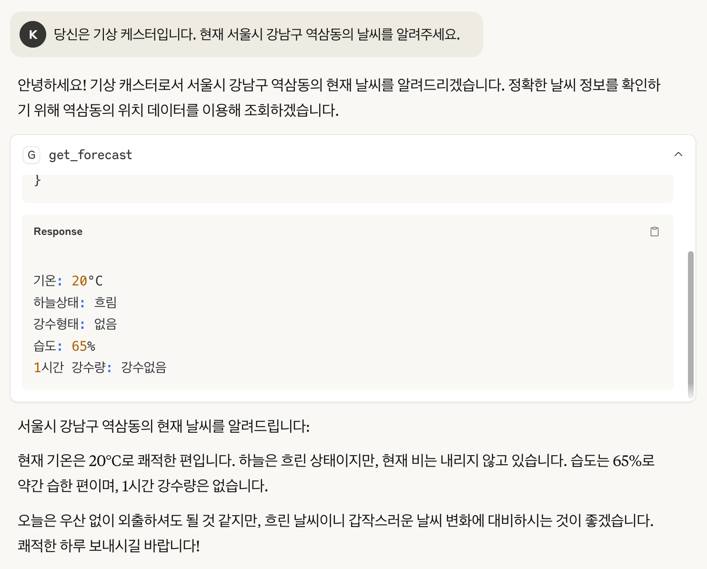

# 대한민국 날씨 정보 MCP 서버

[공공데이터포털의 기상청 초단기예보 API](https://www.data.go.kr/data/15043492/fileData.do?recommendDataYn=Y)를 활용하여 대한민국의 실시간 날씨 정보를 제공하는 Model Context Protocol(MCP) 서버입니다. 

## 기능

- 위도와 경도를 기반으로 한 현재 날씨 정보 제공
- 기온, 하늘상태, 강수형태, 습도, 1시간 강수량 등 상세 정보 제공

## 설치 방법

1. Python 3.13 이상이 필요합니다.
2. [uv 패키지 매니저](https://docs.astral.sh/uv/getting-started/installation/)를 사용하여 의존성을 설치합니다:

새 가상환경을 생성하고 의존성을 설치하려면:

```bash
uv venv --python 3.13
uv sync
```

## 사용 방법

### 환경 설정

1. [공공데이터포털](https://www.data.go.kr)에 회원가입 후 기상청 초단기예보 API 키를 발급받아야 합니다.

2. 발급받은 API 키를 `weather.py` 파일의 `API_SECRET` 변수에 설정합니다.

```python
API_SECRET = '발급받은 API 키를 여기에 입력하세요'
```

### Claude Desktop에서 사용하기

Claude Desktop에서 MCP 서버를 등록하고 사용할 수 있습니다:
   - Claude Desktop 의 Settings 에서 Developer 섹션으로 이동
   - Edit Config 를 선택하여 claude_desktop_config.json 파일을 열어서 편집합니다.
```json
{
  "mcpServers": {
    "weather": {
      "command": "uv 의 절대경로 입력",
      "args": [
        "--directory",
        "weather.py 가 위치한 디렉토리의 절대경로 입력",
        "run",
        "weather.py"
      ]
    }
  }
}
```
   - Claude Desktop 을 다시 시작합니다.


### 응답 예시




## 기술 스택

- Python 3.13+
- FastMCP 2.3.4+
- httpx (비동기 HTTP 클라이언트)
- [uv](https://docs.astral.sh/uv/getting-started/installation/) (Python 패키지 매니저)

## 데이터 출처

- [기상청 초단기예보](https://www.data.go.kr/data/15043492/fileData.do?recommendDataYn=Y) (공공데이터포털)

## 참고 사항

- 초단기예보는 매시간 30분에 생성되고 10분마다 최신 정보로 업데이트됩니다.
- 하늘상태(SKY) 코드: 맑음(1), 구름많음(3), 흐림(4)
- 강수형태(PTY) 코드: 없음(0), 비(1), 비/눈(2), 눈(3), 빗방울(5), 빗방울눈날림(6), 눈날림(7)